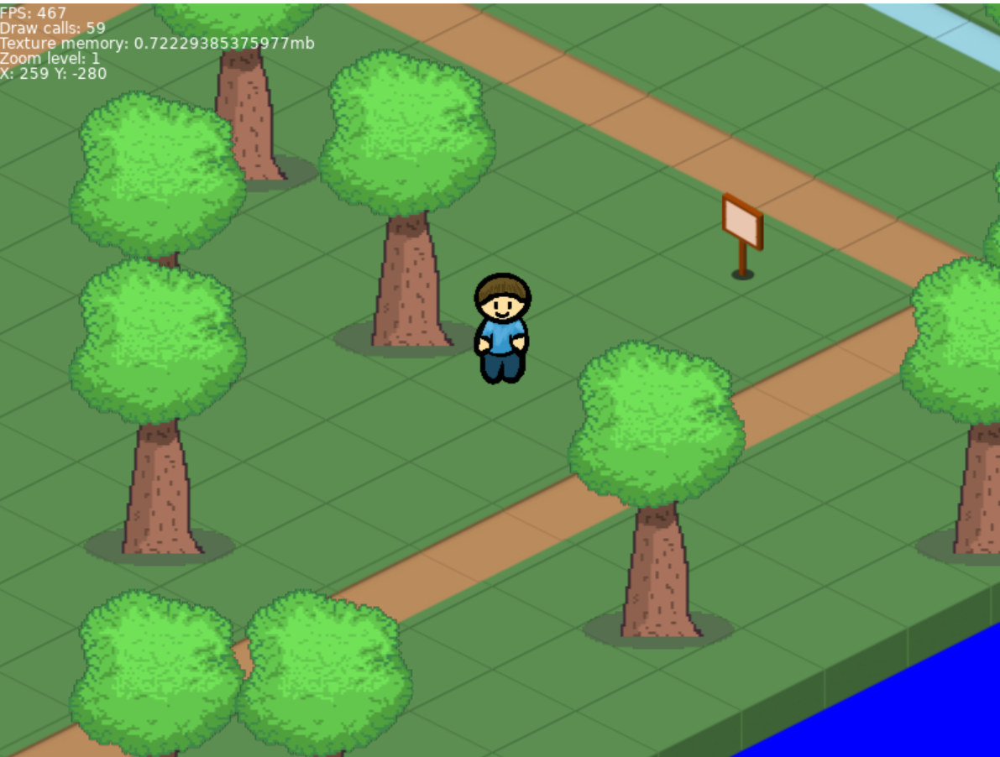

# Practica-Love2d

#  Despre proiect

IsoMap este un joc 2D cu perspectivă izometrică, în stilul jocurilor clasice de tip top-down/isometric . Jucătorul controlează un personaj care se poate deplasa pe o hartă formată din tile-uri (iarbă, apă ,drum), evitând obstacole precum copacii.

Proiectul este in faza de prototip și pune bazele unui motor de randare izometrică: încărcarea hărților, sortarea corectă a obiectelor pe adâncime (z-buffer), coliziuni simple și mișcarea personajului.

#  Cum funcționează

Harta este construită dintr-o grilă de tile-uri pătrate, care sunt "rotite" matematic pentru a crea iluzia de perspectivă izometrică (imaginea de mai jos e generată direct din asset-urile jocului, ca exemplu):

 
| Pas | Ce se întâmplă |
|:---:|---|
| 1 | La pornire (main.lua), se încarcă harta din Map.lua (un tabel Lua ce descrie tile-urile și obiectele de pe fiecare celulă) |
| 2 | isomap.lua transformă coordonatele hărții (rând/coloană) în coordonate de ecran, folosind formula clasică de conversie carteziană → izometrică (toIso / toCartesian) |
| 3 | Tile-urile de sol sunt desenate primele (drawGround), apoi obiectele (copaci, personaj) sunt sortate după poziție și desenate în ordinea corectă, ca cele "mai apropiate" de cameră să apară peste cele "mai îndepărtate" (drawObjects) |
| 4 | Personajul se mișcă cu tastele săgeți; direcția lui (N, S, E, V și diagonale) determină ce sprite este afișat |
| 5 | Coliziunile cu copacii sunt verificate printr-o formulă de suprapunere de elipse, ca să nu poți trece pur și simplu prin obstacole |
| 6 | Camera urmărește automat personajul, iar zoom-ul se ajustează cu rotița mouse-ului |
 

#tehnologii folosite 

Lua – limbajul de programare principal
LÖVE2D (Love2D) – framework/engine 2D open-source pentru jocuri scrise în Lua

# Structura proiectului

games/
├── main.lua          
├── isomap.lua         
├── Map.lua            
├── conf.lua           
├── props/               
└── textures/       

# Continuare

Acesta este un proiect în lucru. Dezvoltarea va continua cu adăugarea de noi funcționalități (hărți mai complexe, mai multe obiecte interactive, animații, sunet etc.).
